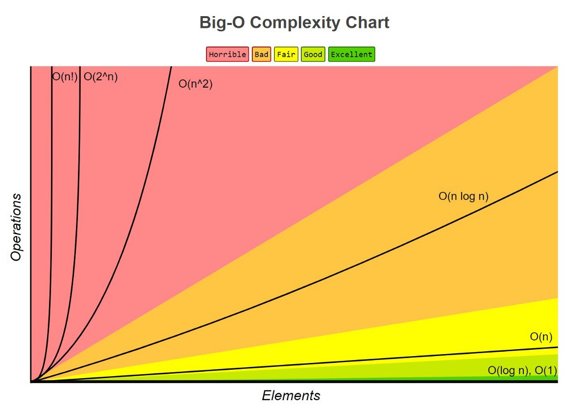

# 算法

## 时间复杂度

### 什么是时间复杂度？

算法的执行效率
算法的执行时间与算法的输入值之间的关系

```js
function test(num) {
  let total = 0; // 执行时间是 a
  for (let i = 0; i < num; num++) {
    total += i; // 执行时间是 b
  }
  return total; // 执行时间是 c
}
```

如果`num=10`，总执行时间是 `a + 10b + c`。对执行时间影响最大的是`10b`，用大 O 表示法就是 `O(N)`

### 常见时间复杂度案例分析

- O(1)： 表示算法执行时间和 num 是没有关系的 (没有`for`或`while`循环)

```js
function O1(num) {
  var i = num; // 执行时间是 a
  var j = num * 2; // 执行时间是 b
  return i + j; // 总的执行时间是 a + b 是常数
}
```

- O(log(n))：循环执行了 `log(n)` 次

```js
function OlogN(num) {
  let i = 1;
  while (i < num) {
    // 循环执行了log(n) 次
    i = i * 2;
  }
  return i;
}
```

- O(n)：循环执行了 `n` 次

```js
function ON(num) {
  let total = 0;
  for (let i = 0; i < num; num++) {
    // 循环执行了 n 次
    total += i;
  }
  return total;
}
```

- O(M+N)：两个循环，关系是并列的

```js
function OMN(num1, num2) {
  let total = 0;
  for (let i = 0; i < num1; i++) {
    total += i;
  }
  for (let j = 0; j < num2; j++) {
    total += j;
  }
  return total;
}
```

- O(nlog(n))： 循环执行了 `n * log(n)` 次

```js
function NLogN(num1, num2) {
  let total = 0;
  let j = 0;
  for (let i = 0; i < num1; i++) {
    while (j < num2) {
      total += i + j;
      j = j * 2;
    }
    j = 0;
  }
  return total;
}
```

- O(n²)： 循环执行了 `n²` 次

```js
function ON2(num) {
  let total = 0;
  for (let i = 0; i < num; i++) {
    for (let j = 0; j < num; j++) {
      total += i + j;
    }
  }
  return total;
}
```

### 常见的时间复杂度对比



- O(log(n)) 二分查找
- O(nlog(n)) 排序

## 空间复杂度

### 什么是空间复杂度

算法的存储空间与输入值之间的关系

```js
// 空间复杂度 O(1)
function test(num) {
  let total = 0; // 变量占用空间
  for (let i = 0; i < num; i++) {
    total += i;
  }
  return total;
}
```

```js
// 空间复杂度 O(N)
function test(num) {
  let array = [];
  for (let i = 0; i < num; i++) {
    array.push(i);
  }
  return array;
}
```
### 常用空间复杂度案例分析
- 常量：`O(1)`
- 集合：`O(N)`  Array，List，LinkList，Map， Queue， Stack
- 递归：`O(N)` 递归栈

## 总结
时间和空间只能二选一：时间换空间，或者空间换时间
# 数据结构

- [数据结构](https://www.bilibili.com/video/BV1sy4y1q79M)

# 算法题讲解

- [Leetcode 力扣 1-300 题视频讲解合集](https://www.bilibili.com/video/BV1xa411A76q)
- [Leetcode 力扣 301+题视频讲解合集](https://www.bilibili.com/video/BV1eK4y1j7fT)

# 刷题（按照标签来刷）

- [leetcode](https://leetcode-cn.com/)
